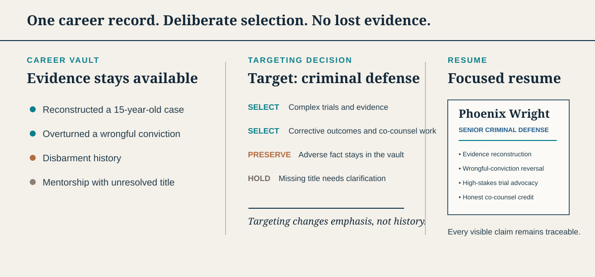

# Resume Builder

**Keep the strongest parts of every resume version, then build honest, targeted
resumes without starting over.**

Your career is bigger than two pages. What matters most will change with each
opportunity, so tailor every resume to the job while preserving the rest of your
story.

Resume Builder gives an AI agent a private, organized record of your career. It
brings together useful details scattered across old resumes, LinkedIn exports,
and career notes so they remain available for future resumes.

**Requires:** a local source checkout · Python 3.11 or newer · Codex or Claude Code

## Start here

Clone this repository, open the checkout in Codex or Claude Code, and say:

```text
Set up Resume Builder and help me import my existing resume.
```

The agent installs the project, starts the introduction, creates your private
workspace, and asks how you want to protect it. Returning users skip first-run
intake because the agent inspects the existing workspace before asking questions.

Once setup is complete, you can ask naturally:

```text
Build a Support Operations resume from my career history.
Screen this job: <posting URL>
Tailor my closest resume to this job description: <paste description>
Update my Incident Management resume without losing approved content.
What important experience is missing from this draft?
```

Quick screens and detailed matches use the same gate-first semantic classifier.
It keeps required role evidence separate from resume polish and exact keyword
retrieval, and it never reports an ATS score or interview probability.

<details>
<summary>Manual installation</summary>

```bash
git clone https://github.com/Jordan-Horner/resume-builder.git
cd resume-builder
python -m venv .venv
source .venv/bin/activate
python -m pip install -e ".[dev]"
python -m playwright install chromium
resume-builder
```

</details>

## See the preservation model in one minute

The included Phoenix Wright fixture starts with one fictional career record. The
agent selects the evidence that supports a senior criminal-defense direction,
keeps adverse history available without presenting it as an accomplishment, and
refuses to use mentorship claims whose exact role placement is unresolved.

[](examples/phoenix-wright/README.md)

| Vault evidence | Resume decision | What the safeguard proves |
|---|---|---|
| Reconstructed a fifteen-year-old case | Lead with it | Strong, target-relevant proof is easy to find. |
| Supported another attorney as co-counsel | Include with limited ownership | Collaboration does not become false leadership. |
| Disbarment history | Preserve; do not sell | A true fact does not automatically belong on a resume. |
| Mentorship under an unresolved interim title | Hold for clarification | The agent does not guess chronology to complete a story. |

The [complete fictional case study](examples/phoenix-wright/README.md) shows the
source material, selection decisions, current resume, and an alternate direction
the evidence cannot yet support cleanly.

## Why this exists

Changing a resume for one opportunity can quietly remove a strong bullet, metric,
project, or leadership example that would help with the next one. Repeated AI
rewrites create another risk: wording can become stronger than the underlying
experience.

Resume Builder keeps your career history separate from any individual resume:

- Old accomplishments remain available even when they do not fit the current
  target.
- Each resume can emphasize a different direction without changing the facts.
- Job descriptions guide what to highlight but never become evidence about you.
- New memories strengthen future resumes instead of living in one temporary chat.

There is no single “master resume” that must contain everything. Your private
career record is the foundation; each resume is a focused view of that record.

## What the agent does

1. **Builds your career record.** Import resumes, pasted text, a LinkedIn export,
   career notes, or begin with a guided interview. Useful claims retain their
   sources and employment context.
2. **Targets one direction.** Choose a role or provide a real job posting. The
   agent selects relevant stories and records what it intentionally leaves out.
3. **Drafts and checks the resume.** It looks for unsupported metrics,
   exaggerated authority, lost accomplishments, weak wording, and missing
   evidence. Named content templates keep section architecture explicit, while
   separately selected visual themes control appearance without changing the
   career argument.
4. **Shows you the result.** An independent reviewer always checks new or changed
   resume language. A deeper career-strategist and hiring-manager review runs
   when the resume is competitive but can be positioned more strongly. You
   approve a readable web preview before the system
   creates a final, format-checked PDF. The preview step returns a structured,
   required handoff with organized, ready-to-post Markdown so the agent presents
   the complete review prompt instead of merely generating a file in the
   background. For a real posting, the browser tab, preview handoff, and mint
   result identify the company and role so concurrent applications remain easy
   to distinguish. Final application PDFs are collected under `exports/resumes/`;
   company targeting stays in the folder name, while the upload-visible PDF uses
   the neutral `<candidate-name>-Resume.pdf` filename. Internal manifests,
   previews, and diagnostics stay grouped under
   `build/resumes/<resume-slug>/`.

Resume presentation is extensible without forking the resume workflow. Content
templates control allowed sections and their order; visual themes control only
typography, color, spacing, and print styling. Workspaces include a compatible
default and an alternate conservative theme. Use
`resume-builder workspace templates list` to inspect them,
`resume-builder workspace templates scaffold theme <id>` to create a custom
theme, and `resume-builder workspace templates validate` before using it.

If a draft is weak, the agent checks your saved career evidence and imported
sources before asking a question. It asks only focused questions that could
materially improve the resume; it does not ask you to repeat information it
already has or invent a metric to fill a gap.

## Your career data stays private

The reusable Resume Builder engine and your personal career data use separate Git
repositories inside one project folder:

```text
resume-builder/          Reusable engine
└── workspace/           Your ignored, private Git repository
    ├── vault/           Career sources and facts
    ├── directions/      Roles you may pursue
    ├── job-search/      Private inventory, search settings, and shortlist
    ├── targets/         Job postings you choose to save
    └── resumes/         Your resume source files
```

The public engine ignores `workspace/`, so normal engine commits do not include
your career files. During setup, choose either:

1. **Local Git with a private GitHub backup** (recommended).
2. **Local Git only** if you do not want anything uploaded.
3. **An existing private workspace** that you already manage.

Nothing is uploaded without confirmation. A private backup is recommended because
local Git cannot recover files after device loss.

## Build and screen a job inventory

Resume Builder includes a local inventory backend for LinkedIn, Indeed, and
direct employer ATS boards. Collection can run manually or through the native
low-noise automation service; there is no authenticated LinkedIn automation.
Mutable inventory, schedules, and personal search preferences stay under the
private workspace.

```bash
resume-builder jobs update
resume-builder jobs new
resume-builder jobs new --retry-failed
resume-builder jobs status
resume-builder jobs shortlist
resume-builder jobs screen <job-id>
resume-builder jobs verify <job-id>
resume-builder jobs reposts
```

`update` collects from enabled providers and preserves valid jobs even when they
do not match the current work-mode preference. `new` performs that refresh and
returns only active canonical jobs that were not already present in the database;
it does not recycle the existing backlog. `shortlist` cheaply separates
interest, constraints, and exact resume keyword visibility across the active
inventory. It reuses unchanged analyses based on posting, resume, preference,
and prescreen versions. It also writes `job-search/jobs-review.csv`, a compact
title/company/salary queue sorted by title and descending salary. Personal
work-mode, location, title, company, salary, and per-job disposition filters affect this review queue
without deleting jobs from inventory. Location include/exclude terms and the
unknown-location policy are configurable in `job-search/preferences.yml` for
different countries and regions. An optional seniority gate can retain senior
roles only for configured role families instead of rejecting every title that
contains `Senior`, `Sr.`, `Lead`, `Staff`, or `Principal`. Its bounded keyword-readiness value is
diagnostic—not an ATS score or a hiring prediction. Ask the agent to screen a
shortlisted job ID for the deeper semantic evidence review; only jobs you choose
to pursue become tracked target snapshots.

Provider refreshes retain typed outcomes (`healthy`, `healthy-empty`, `capped`,
`partial`, `blocked`, or `failed`). Transient empty failures receive one bounded
retry, `jobs status` shows each source's latest state and problem streak, and
`jobs new --retry-failed` reruns only failures marked safe to retry. Screening
also performs a conservative live-URL check for postings backed by a direct ATS;
aggregator-only URLs remain inconclusive instead of being guessed open or closed.

## Record applications and outcomes

Application history is private, Git-versioned workspace data. It stays separate
from the canonical career-fact vault: a submitted answer can cite confirmed facts,
but it cannot establish a new one.

```bash
resume-builder application record --company Example --role "Support Engineer" --job-id <job-id>
resume-builder application record --company Example --role "Support Engineer" --job-id <job-id> --apply
resume-builder application outcome <application-id> interview --stage "Recruiter screen" --apply
resume-builder application outcome <application-id> rejected --feedback "Verbatim feedback" --apply
resume-builder application report
resume-builder application validate
```

Writes require `--apply`; otherwise commands return a preview. Events are
append-only, corrections explicitly supersede an earlier event, and application
dates are never inferred from posting or inventory dates. Recorded job IDs are
automatically treated as applied during shortlisting. Outcome reports show raw
counts and withhold rates until at least ten applications in a group have
concluded. Reports never modify the match rubric or claim an interview
probability.

When a job has already been prescreened, `record` automatically pins that
decision and its analysis hash. `--target`, `--resume`, and `--match-report`
can additionally pin the submitted artifacts and detailed match record.

Submitted application answers can be preserved with canonical fact citations
and retrieved for similar future questions. Unknown and `needs-review` fact IDs
are rejected. Application commands always read and write the active private
workspace; they do not accept an alternate output root. `jobs reposts` provides
an advisory same-employer, exact-title signal while excluding concurrent
postings, shared provider identities, and configured multi-employer aggregators.
The repost calculation is read-only, and its output records the detector options
used for that run.

## Detect submitted applications from Gmail

The optional Gmail adapter uses Google's official read-only client to detect
explicit application confirmations and strongly contextual rejections. It
automatically creates or links an `applied` application only when company and
role identity are both present. A rejection updates only one confidently
matched existing application; it never invents a new application. Ambiguous and
unrelated messages do not change application history. Explicit recruiter
outreach, interview invitations, assessments, and offers can advance a uniquely
matched existing application without retaining the correspondence.

```bash
python -m pip install -e ".[gmail]"
resume-builder gmail connect                              # show setup step 1
resume-builder gmail connect --step 2                     # show another setup step
resume-builder gmail connect --credentials /secure/path/google-client.json  # scripted setup
resume-builder gmail scan                         # preview new labeled mail
resume-builder gmail scan --apply                 # commit confident matches
resume-builder gmail backfill                     # preview historical matches
resume-builder gmail backfill --apply             # reconstruct applications
resume-builder gmail status
```

## Run the private career-agent foundation

The optional agent uses PydanticAI with OpenRouter behind provider- and
communication-channel adapters. Its first toolset is read-only.

```bash
python -m pip install -e ".[agent]"
resume-builder agent init
resume-builder agent doctor
resume-builder agent ask "What new jobs are ready to review?"
```

The generated configuration contains no API key. See
[the agent architecture and implementation cycles](docs/agent.md).

Normal scans use a narrow Gmail server-side query for recent application
confirmations and rejection signals; no labels or Gmail filters are required.
Historical backfill uses the same application-activity query over a longer
window and processes messages oldest first. Gmail bodies are processed in memory
and never written to
the engine, private workspace, runtime database, or logs. The OAuth token,
mailbox cursor, message IDs, and dispositions live in an external runtime
directory with owner-only file permissions. See
[`docs/gmail-automation.md`](docs/gmail-automation.md) for setup, privacy, and
scheduling guidance.

## Schedule job and Gmail scans

The native automation service can run job discovery once or twice daily and
Gmail reconciliation every few hours, then notify only when a meaningful change
is found. Console output is the default; Discord uses an environment-provided
webhook and a durable deduplication outbox. Docker Compose is supported without
putting the workspace, OAuth token, runtime databases, or webhook secret in the
image.

```bash
resume-builder automation init --timezone America/New_York
resume-builder automation doctor
resume-builder automation once --task jobs
resume-builder automation run
```

See [`docs/automation.md`](docs/automation.md) for schedules, notifications,
privacy boundaries, and Docker deployment.

If a repository has ever contained real career data, keep its complete Git history
private. Removing personal files from the latest version does not remove them from
earlier commits.

## How it keeps the result honest

- **Claims retain their sources.** Resume statements can be traced back to saved
  career evidence.
- **Targeting cannot become biography.** A role profile or job posting can guide
  selection but cannot establish candidate experience.
- **Important information is checked for accidental removal.** Plans and
  regression checks distinguish deliberate targeting from a lost accomplishment.
  Every new or changed narrative block receives an independent language check
  before preview. Exact approved unchanged blocks are reused. The deeper career
  review runs only when hybrid routing finds an improvable fit or the user asks
  for it.
- **The user owns the wording loop.** The normal lifecycle is build, language
  review, preview, edit, changed-block review, preview, and mint. An explicit
  mint request approves the current
  preview; mint then performs the hard source, evidence, page, rendering, and
  PDF-extraction checks.
- **Drafting stays conversational until wording is chosen.** If you reject or
  question a sentence, the agent proposes distinct alternatives without
  starting build and review work. Once you select one, only the changed language
  is reviewed; unchanged strategy and hiring judgments carry forward.

These safeguards do not predict an employer's decision or produce a universal ATS
score. They make the resume easier to verify, revise, and defend.

## Help and contributing

For setup problems or feature requests, [open an
issue](https://github.com/Jordan-Horner/resume-builder/issues/new). Use fictional or
redacted examples only—never attach a real resume, career source, contact details,
or private job-search information to a public issue.

- Read [CONTRIBUTING.md](CONTRIBUTING.md) before proposing a change.
- Follow [SECURITY.md](SECURITY.md) to report a vulnerability or privacy concern.
- Resume Builder is available under the [Apache License 2.0](LICENSE).

<details>
<summary>Contributor checks</summary>

```bash
pytest
ruff check src tests scripts .agents/skills/hydrate-vault/scripts
ruff format --check src tests scripts .agents/skills/hydrate-vault/scripts
mypy src
python -m build
python scripts/audit_distribution.py
python scripts/check_architecture.py
```

</details>
