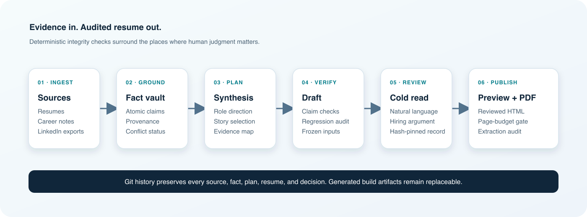
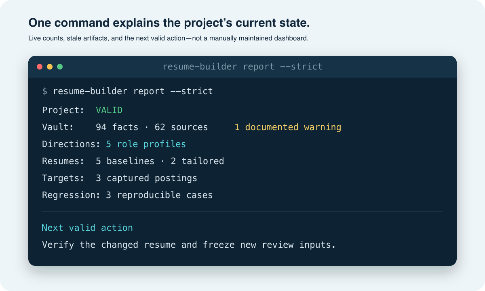
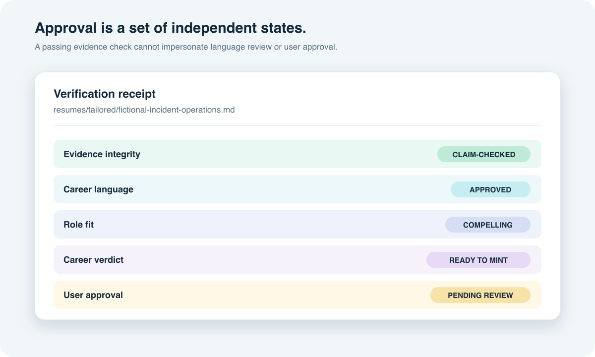

# Resume Builder

**Evidence in. Audited resume out.**

Resume Builder is a local-first, Git-tracked career vault that creates
role-specific resumes without losing useful accomplishments or inventing
unsupported claims. It combines deterministic evidence checks with a separate
career-professional review, then publishes reviewed HTML and audited PDFs.



<p align="center">
  
  
</p>

## Why this is different

- **Career facts remain durable.** Imported resumes and notes become atomic,
  source-linked facts instead of disappearing into a generated “master” file.
- **Targeting cannot invent experience.** Role research and job postings guide
  selection, but they never become candidate evidence.
- **Drafts are reproducible.** Versioned synthesis plans record story purpose,
  evidence composition, intentional omissions, reviewer risks, and page budget.
- **Approval cannot silently go stale.** Every narrative block is reviewed and
  pinned to exact resume, plan, direction, target, build, and fact hashes.
- **Output is release-gated.** Reviewed web previews precede PDF minting, which
  checks pagination, overflow, blocked network activity, and text extraction.

The fastest way to understand the system is the [architecture
overview](docs/architecture.md), followed by the [60-second demo
script](docs/demo.md). The [design decisions](docs/design-decisions.md) explain
the major tradeoffs, and the [portfolio case study](docs/portfolio-case-study.md)
summarizes the project for hiring conversations.

The approved [Phoenix Wright fictional fixture](examples/phoenix-wright/README.md)
provides a complete public-safe workspace for validation, synthesis, compilation,
and review demonstrations without using anyone's private career history.

> [!IMPORTANT]
> Resume Builder keeps its reusable engine and private career workspace in
> independent Git repositories. The engine ignores `workspace/`; the workspace
> owns its vault, resumes, job targets, and private history. Never force-add the
> workspace to the engine repository.

Resume Builder also helps you continuously improve a resume without losing
useful information from earlier versions. Instead of treating every rewrite as
a fresh start, it imports old resumes, new resumes, and career notes into one
private, Git-tracked career vault.

Each source contributes to a growing record of your roles, skills, projects,
stories, and accomplishments. When you remember something new or create a
better resume, that information can be added incrementally while earlier facts
and wording remain available. Future resumes can then draw from the complete
record and emphasize the experience most relevant to a particular role.

## Purpose

Traditional resume editing makes it easy to improve one version while
accidentally dropping a valuable bullet, metric, project, or detail from
another. Resume Builder is designed to prevent that regression.

Its core workflow is:

1. Import previous resumes and career notes as source evidence.
2. Add new resumes, accomplishments, and remembered details over time.
3. Consolidate that information into a durable master career record without
   deleting earlier evidence.
4. Build focused resumes from the master record while preserving every version
   in Git history.

The result is not one permanently “final” resume. It is an evolving foundation
that becomes more complete and useful with every update.

The software and the agent have separate jobs. The `resume-builder` command
provides deterministic source registration, validation, evidence checks,
compilation, matching diagnostics, freshness reporting, and PDF auditing. The
repository skills guide the agent's judgment: which evidence to select, how to
shape a role-specific argument, what research is needed, and whether a draft is
persuasive enough to mint. A passing compiler proves traceability and
structure; it does not substitute for editorial review.

## How information is organized

The private workspace deliberately separates six layers:

- `vault/facts/` contains atomic canonical career facts.
- `vault/employment/` indexes facts by employer and preserves organization
  metadata.
- Schema v2 assigns employment accomplishments to supported role IDs or keeps
  them explicitly at organization scope when chronology is unresolved.
- `directions/` is the Git-tracked role database: researched role expectations,
  positioning priorities, and evidence queries, never candidate facts.
- `targets/` preserves one real job posting, its provenance, focused criteria,
  and exact retrieval groups for job-specific matching.
- `resumes/` will contain versioned Markdown resumes created from the vault.
- `editorial/rules/` contains accepted, versioned user guidance about claim
  meaning and presentation; it is not career evidence.
- `build/` contains disposable rendered output such as PDF and HTML.

Markdown and Git history are permanent. Search indexes, databases, generators,
and rendered documents are replaceable downstream layers.

The engine repository contains only reusable Python code, generic templates,
agent workflows, documentation, and approved fictional test material. A private
workspace is runtime user data and is never an engine dependency.

## Install

Resume Builder requires Python 3.10 or newer.

```bash
python -m venv .venv
source .venv/bin/activate
python -m pip install -e ".[dev]"
python -m playwright install chromium
```

This installs PDF and DOCX support, a pinned Chromium renderer, and the
`resume-builder` command.

## Initial workflow

Run the command with no arguments in a terminal, or invoke initialization
directly:

```bash
resume-builder
# or
resume-builder init
```

The introduction creates `workspace/` as an independent local Git repository,
then asks how to protect it:

1. **Local Git plus a private GitHub backup (recommended).** The engine creates
   the GitHub repository as private, verifies that GitHub reports `PRIVATE`, and
   only then pushes the first workspace checkpoint. The default repository is
   `<authenticated-owner>/resume-vault`; an explicit `OWNER/NAME` can override
   it.
2. **Local Git only.** Nothing is uploaded, but the engine warns that local Git
   cannot protect against device loss.
3. **Existing private workspace.** Connect an existing private Git repository
   without rewriting its vault or Git history. GitHub origins must verify as
   `PRIVATE`; other or temporarily unverifiable origins require an explicit
   acknowledgement and are never described as verified backups.

No remote is created without explicit confirmation. Automated and
non-interactive runs never open a prompt and default to local-only storage.
Connect an existing workspace non-interactively with:

```bash
resume-builder init --existing --workspace /exact/path/to/private-workspace
```

Inspect the active boundary at any time with:

```bash
resume-builder workspace show
```

This reports the resolved private workspace, independent-Git status, origin,
and whether its backup privacy was verified. Resume Builder never pushes while
inspecting or connecting an existing workspace.

Create the conventional private GitHub backup non-interactively with:

```bash
resume-builder init --storage github
```

This uses the authenticated GitHub owner's `resume-vault` repository. Pass
`--github-repo OWNER/NAME` only when a different private name is intentional.

The existing directory must already be an independent Git repository and must
contain `vault/vault.json`. When it sits inside another repository, the parent
must ignore it before Resume Builder will connect it.

Once the workspace exists, tell the agent you want to get started. If it finds no
registered source material or career facts, it will ask you for one of the
following: resume files, the exact folder path where they are stored, pasted
resume text, a LinkedIn export, or career notes. If you do not have a resume, it
can guide you through your career history instead. It will not broadly search
your computer without a location you provide.

The underlying workflow is:

1. Preview existing materials with `resume-builder hydrate <files-or-folders>`
   or let the agent invoke the `hydrate-vault` skill.
2. Register accepted sources with the same command plus `--apply`.
   Exact duplicates remain idempotent. A previously empty extraction is retried
   and refreshed under its existing source ID when the current extractor can
   recover text.
3. Review and apply the skill's versioned canonical change plan.
4. Commit the approved vault changes.
5. Review the compact import handoff. The agent reports what was captured and
   any contradictions, then asks for the target direction; it does not begin a
   generic resume-strengthening interview.
6. Add new memories through reviewed change plans as they surface.
7. Ask the agent to build a directional baseline, tailor a resume to a job, or
   update an existing resume with the `build-resume` skill.
   If the role shape is missing or stale, use `research-role` first to research
   an anchor opportunity and similar roles, then update `directions/`.
8. For a fresh baseline or substantial rewrite, the builder first creates a
   versioned, compiler-enforced synthesis plan under `resumes/plans/` that
   groups vault facts into career stories,
   assigns every proposed bullet a distinct job, preserves progression,
   distinguishes required core stories from optional supporting stories, and
   records intentional omissions before writing resume prose. New version 6
   plans also resolve the page budget, state what the summary must accomplish
   and which facts support it,
   identify the target as direct, adjacent, or exploratory, classify every role
   concept as demonstrated, transferable, or unsupported, map the few reviewer
   objections that could change the hiring read, and decide whether optional
   sections have a distinct job. They allocate an explicit story arc to every
   experience placement, separate required from optional stories, and assign
   exact action, object, scope, and outcome evidence to each visible claim so
   recent and target-critical roles receive enough
   distinct evidence to make a complete argument without relying on a fixed
   bullet count.
9. When deciding whether an opening deserves more effort, invoke `screen-job`
   for a one-page, read-only review of the company, employment setup, pay,
   closest resume, ATS visibility, career direction, and any questions that
   could materially improve the match.
10. After choosing to pursue a real opening, capture it under `targets/` and
   invoke `match-job` to distinguish exact retrieval from actual evidence. A
   tailored resume remains separate from its directional baseline, and the
   match report compares both.
11. Run `resume-builder verify <resume>` as the normal handoff into review. It
   compiles the draft, runs the direction and optional target checks, writes a
   compact verification receipt, and freezes the cold-read package and reviewer
   decisions file. An unchanged rerun reuses those hash-pinned results.
12. Review the draft through `critique-resume`. Every new or changed narrative
   block requires an explicit career-professional decision. Complete the
   generated decisions file and run `resume-builder review finalize`; the
   command constructs and validates the version 4 record—or version 5 when
   accepted feedback rules apply—without manual hash assembly.
13. If an authorized end-to-end run receives a single clear wording-only repair,
   run `resume-builder review apply-repairs`, re-verify, and send the changed
   block through a fresh independent review without pausing for another wording
   approval. Missing facts, changed authority, and strategic choices still
   require user input.
14. When the user directly rejects or requests a change to visible resume
   wording, record it as a temporary feedback session before editing. Repeated
   corrections update that session, so only the latest interpretation guides
   the next attempt. Resolve accepted rules and open sessions before drafting;
   check both after, never during, the independent cold review.
15. After the user accepts the reviewed preview, promote each intended session
   by ID with that preview. Unchanged effective guidance preserves the preview
   for minting. Close cosmetic feedback without memory and route factual changes
   through hydration.
16. Route material findings to the right source: rebuild from existing evidence,
   hydrate a missing career fact, or adjust the direction profile.
17. Rebuild after the routed change and re-run critique only when the content or
   direction changed materially.
18. Publish the continuous web preview after review, then mint the final PDF only
   when the resume is ready and explicitly approved.

Example requests:

```text
Screen this job: <posting URL>
Build a Support Operations baseline resume.
Build an FDE resume and use your best judgment on length.
Tailor my closest baseline to this job description: <paste description>
Update my Incident Management resume without losing approved content.
```

The agent reads the vault before asking questions, proposes evidence-backed
directions when the target is unclear, and reports material additions,
removals, and rewrites before replacing approved content. If the vault already
contains canonical facts but `resumes/` is empty, the agent will move directly
to choosing or creating the first direction before building a baseline instead
of asking for the source resumes again.

For a new directional baseline, the builder does not reconstruct one imported
resume. It selects the strongest relevant evidence from the complete vault,
groups complementary facts into coherent stories, and composes a new argument
for the target audience. Only after the draft is complete may it compare the
result with an original resume from the same lane to identify retained,
strengthened, intentionally omitted, missing, or regressed evidence. Textual
difference alone is not improvement; the comparison judges evidence use and
career meaning.

Useful health checks:

```bash
resume-builder report --strict
resume-builder validate --strict
resume-builder plan preview build/hydration-plan.json
resume-builder compile resumes/baselines/support-operations.md
resume-builder verify resumes/baselines/support-operations.md
resume-builder review package resumes/baselines/support-operations.md
resume-builder review question-plan build/reviews/support-operations.questions.json
resume-builder review question-plan build/reviews/support-operations.questions.json --apply
resume-builder review question-resolve resumes/baselines/support-operations.md <gap-key> \
  --status <unknown|declined|accept-gap>
resume-builder review apply-repairs build/reviews/support-operations.decisions.json
resume-builder review finalize build/reviews/support-operations.decisions.json
resume-builder review validate build/reviews/support-operations.json
resume-builder feedback validate
resume-builder feedback record build/feedback-plan.json [--session FB-...]
resume-builder feedback resolve resumes/plans/support-operations.yaml --include-open
resume-builder feedback accept FB-... --preview build/support-operations.preview.json
resume-builder preview resumes/baselines/support-operations.md
resume-builder mint resumes/baselines/support-operations.md
resume-builder mint resumes/baselines/support-operations.md --max-pages 1
resume-builder direction validate
resume-builder match validate
resume-builder direction audit \
  directions/support-operations.md \
  resumes/baselines/support-operations.md
resume-builder match \
  targets/<posting>.md \
  resumes/tailored/<company>-<role>.md \
  --baseline resumes/baselines/<direction>.md
resume-builder eval validate
resume-builder eval grade evals/cases/support-operations.yaml
pytest -m "not browser"  # Fast local suite without launching Chromium
pytest
```

`verify` is the normal content-only quality gate. It writes
`build/<resume>.verify.json` and reports one of four lifecycle states:
`draft`, `awaiting-review`, `reviewed`, or `published`. It reuses a receipt only
when the resume, plan, direction, template, optional target and baseline,
compiled artifacts, and cited facts still match their recorded hashes. Any
narrative edit returns the resume to `draft`; it cannot silently retain an older
review. Run the fast non-browser test suite while developing resume content.
Run the complete software test suite when builder code changes, not for every
resume wording iteration.

`resume-builder report --strict` is the normal starting point after setup. It
summarizes the vault, directions, baseline and tailored resumes, current or
stale builds, critiques, mints, real targets, and regression coverage, then
names one deterministic next action. A dated hydration report remains useful
as an import audit, but it is not the source for live totals.

## Privacy boundary

A hydrated repository contains private career information and must remain
private. Never make its Git history public, even after deleting personal files.
To share Resume Builder with others, publish a clean starter repository or a
history-free export containing the engine, schema, and empty vault only.

## Directory contract

```text
.agents/skills/                Hydration, role research, critique, and build workflows
vault/                         Private career vault, schema versioned
  vault.json                   Machine-readable schema declaration
  facts/                       One Markdown file per canonical fact
    employment/<organization>/ Employer-linked atomic facts
  employment/                  Organization metadata and fact indexes
  sources/                     Normalized source snapshots and manifest
directions/                    Canonical Git-tracked role database
editorial/rules/               Accepted user feedback and claim boundaries
targets/                       Versioned real-posting snapshots and match criteria
resumes/baselines/             Approved directional Markdown resumes
resumes/tailored/              Job-specific Markdown resumes
resumes/plans/                 Versioned evidence-selection and story plans
evals/cases/                   Reproducible regression and holdout definitions
templates/                     ATS-safe HTML presentation templates
build/                         Generated output; never canonical
  feedback/                    Temporary conversational revision sessions
```

The default HTML template is adapted from the ATS-safe career-ops CV template.
It uses a single-column layout, selectable system-font text, standard headings,
print-aware page breaks, and hidden validated evidence metadata. Markdown under
`resumes/` remains canonical. The `compile` command validates its structure,
fact IDs, unresolved-evidence exclusions, numeric support, explicit authorship
and authority verbs, and renderer, then generates review-input JSON and a build
manifest under `build/`. It warns when a bullet opens with low-information tool
language such as “used”; the builder must then lead with a supported
contribution or omit the story rather than inflate the verb. Compilation still
does not prove full semantic entailment. It publishes neither HTML nor PDF.

The review-gated `preview` command publishes the exact reviewed build as
readable HTML only after evidence integrity and a fresh career-professional
review are approved. The page explicitly identifies itself as a continuous web
preview; PDF pagination is calculated only during minting. That web page is the user's final-review surface;
recompiling preserves it but marks its manifest stale. The separate `mint`
command renders that exact user-reviewed HTML as a PDF with
pinned Playwright Chromium, and writes a `.mint.json` audit. Minting blocks
network requests and page JavaScript, waits for fonts, rejects horizontal
overflow, verifies that every page and factual block remains extractable, and
enforces the page budget resolved in the version 6 synthesis plan. An explicit
`--max-pages N` must agree with that plan. A failed page budget retains a
diagnostic PDF but is not a
successful mint. Generated files can be replaced at any time.

The `critique-resume` skill supplies the career-strategist and hiring-manager
judgment that compilation cannot. Every new resume or narrative-content change
must pass this stage before the prose is called approved. The deterministic
`review package` stage creates an isolated cold-read file containing the
target, headline, summary, competencies, bullets, project narrative, and visible
context. A separate evidence appendix pins the build, plan, direction,
structured claims, and canonical facts. It also creates a reviewer-owned
decisions file with the exact block hashes. The reviewer records an explicit
`approved` or `revise` decision for every block, and `review finalize` builds
the persistent record without manual hash assembly. Persistent reviews also pin the
resume, compiled build, cold read, evidence appendix, plan, direction, optional
target, and cited facts, so `report` can identify a review made incomplete or
stale by later changes.

Version 2 decisions may also include one evidence-safe `wording-only` repair
for a rejected block. During an already-authorized revision, preview, or mint
workflow, `review apply-repairs` changes only the exact pinned prose, preserves
the Markdown evidence comments, and immediately returns the resume to
verification and fresh independent review. The workflow pauses only when a
finding needs new facts, changes authority or chronology, removes a distinct
hiring claim, or requires the user to choose between materially different
directions.

Builds with applicable accepted feedback use decisions version 3 and review
record version 5. The cold reviewer still receives only the isolated prose.
After those decisions are fixed, the main reviewer records compliance with each
pinned rule from the evidence appendix. Preview and minting reject a missing or
failed feedback-compliance review.

The builder never approves its own writing. Compilation produces review input
without publishing a resume for user review. Web preview and minting both refuse
missing, stale, incomplete, evidence-failed, or language-rejected reviews. The
preview manifest separately records evidence integrity, career-language review,
role fit, career verdict, and pending user approval. A user may explicitly
accept a documented role-fit or evidence tradeoff with `--accept-review-risk`
and a written `--review-risk-note`, but that option cannot bypass rejected
prose.

New review records also state whether a fresh, isolated reviewer performed the
language gate. That reviewer sees only the isolated cold-read file before
provisional decisions, not the evidence appendix, builder's synthesis rationale,
or proposed fix. Automated advisories are
judgment prompts rather than automatic failures, but an approved flagged block
must record why its wording remains appropriate.

The `screen-job` skill is the lightweight first look for one real opening. It
researches the company or staffing intermediary, employment arrangement, pay,
quality-of-life unknowns, closest existing resume, concise ATS visibility, and
career-direction fit. Its fixed one-page contract leads with the evidence-based
match, names the primary gap, and ends with one specific next action without
capturing the posting or changing the vault or a resume.

The `match-job` skill is intentionally deeper and runs only for a real job
posting. It preserves a source snapshot under `targets/`, checks where exact
posting language appears, distinguishes demonstrated proof from terms that are
only listed, and reviews each required or preferred criterion against cited
resume evidence. When a tailored resume exists, it compares that file with its
baseline so better retrieval cannot hide lost accomplishments or weakened
career progression. It never produces a universal ATS percentage or predicts
an employer decision; its output is explicitly a resume-only match.

Each material critique finding has one next-action route: `rebuild`, `hydrate`,
`direction`, or `mint`. Critique searches canonical facts and registered
snapshots before asking the user; any reusable answer becomes a canonical fact
before final use. When hydration is genuinely needed, the reviewer ranks at
most five focused questions by expected resume value and records stable gap keys
before asking. Unknown, declined, and accepted gaps are not rephrased in later
rounds. A factual answer is saved as a narrow career note and hydrated; the
conversation itself is never treated as source evidence.

Direction profiles provide the separate target for a resume: titles, audience,
positioning, weighted concepts, vocabulary, evidence themes, exclusions, and
success criteria. They begin as explicitly provisional user-shaped guidance and
can later gain researched or outcome-validated sources without changing the
career vault. The deterministic direction audit scores supporting vault
evidence, checks only a small explicitly essential terminology list when one is
configured, and reports broader vocabulary coverage separately as advice. It
also warns when configured terms or concept labels appear mechanically repeated;
those warnings do not fail the build. Direction terms help retrieval and ATS
discoverability—they are not preferred resume wording.

The `research-role` skill maintains those profiles with an anchor-plus-portable-
core method. It compares current official postings and durable frameworks,
separates employer-specific requirements from the broader role family, and
balances technical depth with operational ownership, communication,
cross-functional influence, team enablement, and outcomes. Research can reveal
a gap in the vault, but it can never become a candidate claim by itself.

Regression cases make preservation measurable without turning an old resume
into a writing template. They record material source facts, required career
progression, and immutable source hashes. Grading runs only after a new resume
exists, identifies retained or intentionally excluded evidence, and confirms
that the new resume gained relevant facts from other sources. A separate
seven-dimension editorial review can then judge whether the result is on par or
better; deterministic checks do not pretend to prove semantic quality.

See `AGENTS.md` for project instructions, setup commands, and non-negotiable
editing rules used by Codex.
