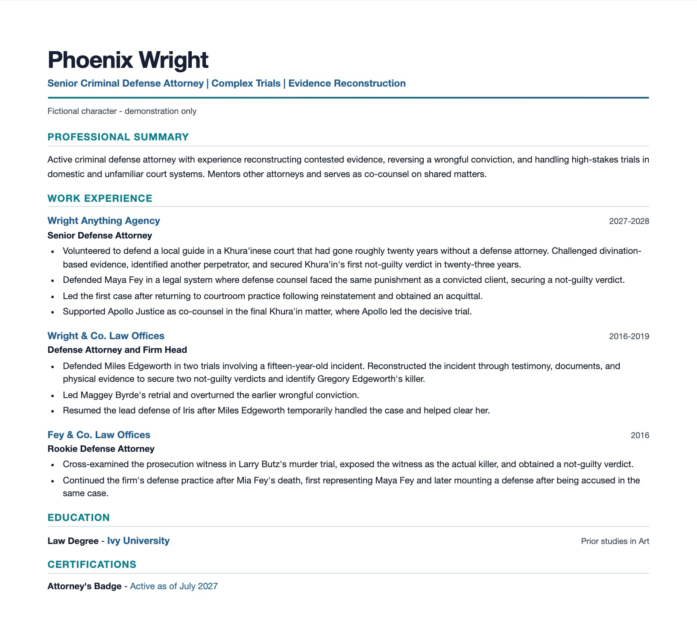

# Phoenix Wright: one career record, one targeted legal resume

This fictional case study demonstrates the part of Resume Builder that an
ordinary AI rewrite cannot: the complete career record remains intact while one
resume selects only the evidence that supports its target.

Phoenix Wright and Ace Attorney are properties of Capcom. This repository uses
short factual career summaries and source links; it contains no game artwork,
audio, scripts, or copied dialogue.

## The thirty-second version

The target is **Senior Criminal Defense Attorney**. The strongest supported
argument combines complex trial work, evidence reconstruction, corrective
outcomes, recent courtroom success, and accurately scoped collaboration.

The vault contains more than the resume uses:

| Evidence in the vault | Decision for this resume |
|---|---|
| Defense of Miles Edgeworth and reconstruction of the DL-6 incident | Selected as the clearest complex-evidence story. |
| Maggey Byrde wrongful-conviction retrial | Selected as a distinct corrective outcome. |
| Co-counsel support for Apollo Justice | Selected, with Apollo retained as lead for the decisive trial. |
| Disbarment after unknowingly presenting forged evidence | Preserved in the vault; excluded as harmful, non-qualifying context. |
| Recruitment and mentorship during the license interruption | Preserved, but withheld because the exact interim role title is unresolved. |

That last row matters: the engine does not improve the resume by assigning a
convenient title the evidence cannot prove.

## The result

The current resume source is
[senior-defense-attorney.md](workspace/resumes/baselines/senior-defense-attorney.md).
Its [versioned synthesis plan](workspace/resumes/plans/senior-defense-attorney.yaml)
records every selected story, role arc, supporting option, reviewer risk, and
intentional exclusion before prose is judged.



## A second direction changes the selection—not the facts

A practice-leadership version would emphasize recruiting and mentoring Apollo
Justice and Athena Cykes. The vault contains that evidence, but the formal title
during the license interruption is unresolved. A responsible build should ask
for or verify that chronology before publishing the alternate resume instead of
quietly turning association with the agency into a management title.

The criminal-defense resume can still be completed from the confirmed evidence.
The leadership direction remains available for later because its stories were
not deleted merely for being unused here.

## Trace one visible claim

The Edgeworth bullet cites `WAA-004`. That canonical fact records two separate
trials, the reconstruction of a fifteen-year-old incident through testimonial,
documentary, and physical evidence, two not-guilty verdicts, and collaborator-safe
attribution. The resume uses the parts that support its one hiring message; the
rest remains available for another version.

- [Canonical fact WAA-004](workspace/vault/facts/employment/wright-anything-agency/WAA-004.md)
- [Researched role direction](workspace/directions/senior-defense-attorney.md)
- [Complete source inventory](source-material/phoenix-wright-career-inventory.md)

## What the fixture exercises

- Source registration and canonical provenance
- Confirmed versus unresolved facts
- Supported role chronology and office-name changes
- A version 6 evidence-synthesis plan
- A researched legal direction, Education, and attorney-status evidence
- An accepted, fixture-local editorial rule
- Automatic exclusion of three `needs-review` claims

The sources intentionally do not name a real-world bar jurisdiction or identify
the law degree as a J.D. or LL.B. The resume preserves those limits.

<details>
<summary>Reproduce the fixture locally</summary>

This is an opt-in demonstration workspace. `resume-builder init` does not copy,
import, or merge these files into a user's private workspace.

From the engine repository after installation:

```bash
export RESUME_BUILDER_WORKSPACE="$PWD/examples/phoenix-wright/workspace"
resume-builder validate --strict
resume-builder direction validate
resume-builder synthesis resumes/plans/senior-defense-attorney.yaml
resume-builder verify resumes/baselines/senior-defense-attorney.md
```

`verify` creates disposable review inputs under the example workspace's
ignored `build/` directory. Use the included agent review workflow to complete
a fresh independent review before publishing a preview or minting a PDF.

</details>

The original research inputs are retained under `source-material/`; the
registered normalized snapshots live inside the example vault.

## Rebuild the canonical vault

The files under `source-material/` are immutable fixture inputs. Their exact
hashes and deterministic source IDs are pinned in
`bootstrap/source-lock.json`. Do not edit an existing input in place: add a
clearly named new source or addendum and update the lock and reviewed hydration
plan together. This restriction applies to the packaged demonstration, not to
user vaults, where revised resumes are registered additively as new evidence.

To prove that the approved canonical facts do not depend on a prebuilt vault,
start with a blank disposable workspace, register the two locked sources, and
apply `bootstrap/hydration-plan.json` through `resume-builder plan validate`,
`preview`, and `apply`. The test suite performs that complete reconstruction,
compares every canonical fact, employment index, and hydration-report entry
with the approved fixture, then reimports the sources and requires zero new
registrations.

The approved workspace also retains the historical `SRC-3aba7a92ce43`
normalized snapshot. Its original raw bytes were never committed, so it is
preserved for audit history but is not used as bootstrap evidence. Canonical
facts cite the current, approved, reproducible inventory source
`SRC-f953554da1da` instead.
